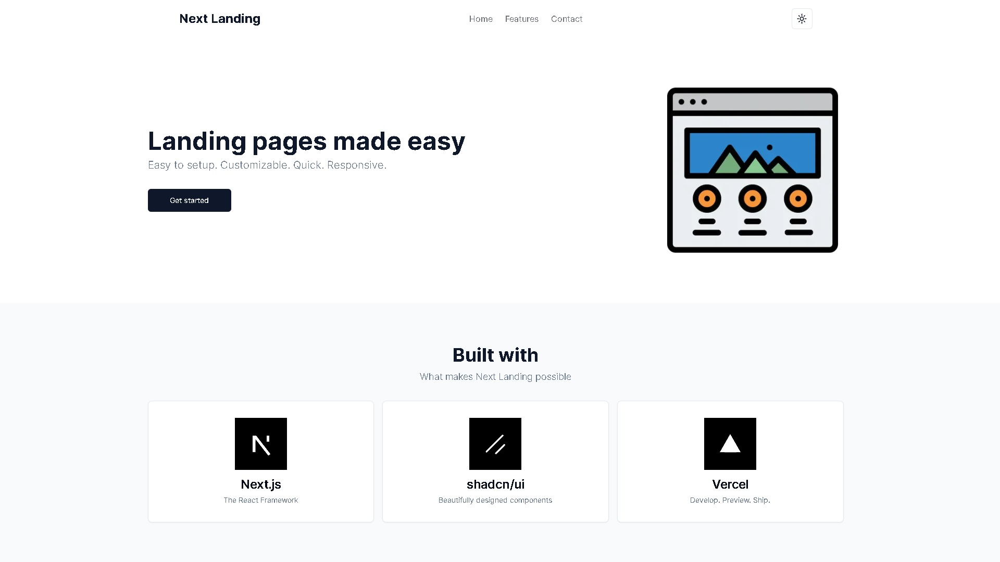

# Next Landing

Easy to setup, customizable, quick, and responsive landing page starter built with [Next.js](https://nextjs.org) and [shadcn/ui](https://ui.shadcn.com).

- [Live Preview](https://nextlanding.rdev.pro)

## Preview



## Getting Started

Follow the instructions based on the package manager you use (npm/pnpm)

### Start by setting up a new project

```bash
npx degit redpangilinan/next-shadcn-landing my-app
```

```bash
pnpm dlx degit redpangilinan/next-shadcn-landing my-app
```

### Change package.json name

```json
"name": "next-shadcn-landing",
```

to

```json
"name": "my-app",
```

### Install dependencies

```bash
npm install
```

```bash
pnpm install
```

### Run the newly created app

```bash
npm run dev
```

```bash
pnpm run dev
```

### That's it

Open [http://localhost:3000](http://localhost:3000) with your browser to see the result.

Modify the content and website configurations in the `/config` folder.

Modify the layout and routes in the `/app` folder.

Change navigation links by modifying `lib/links.ts` file.


## Deploy on Vercel

The easiest way to deploy your Next.js app is to use the [Vercel Platform](https://vercel.com/new?utm_medium=default-template&filter=next.js&utm_source=create-next-app&utm_campaign=create-next-app-readme) from the creators of Next.js.

Check out [Next.js deployment documentation](https://nextjs.org/docs/deployment) for more details.

## License

This project is licensed under the [MIT License](https://opensource.org/licenses/MIT) - see the [LICENSE](LICENSE) file for details.